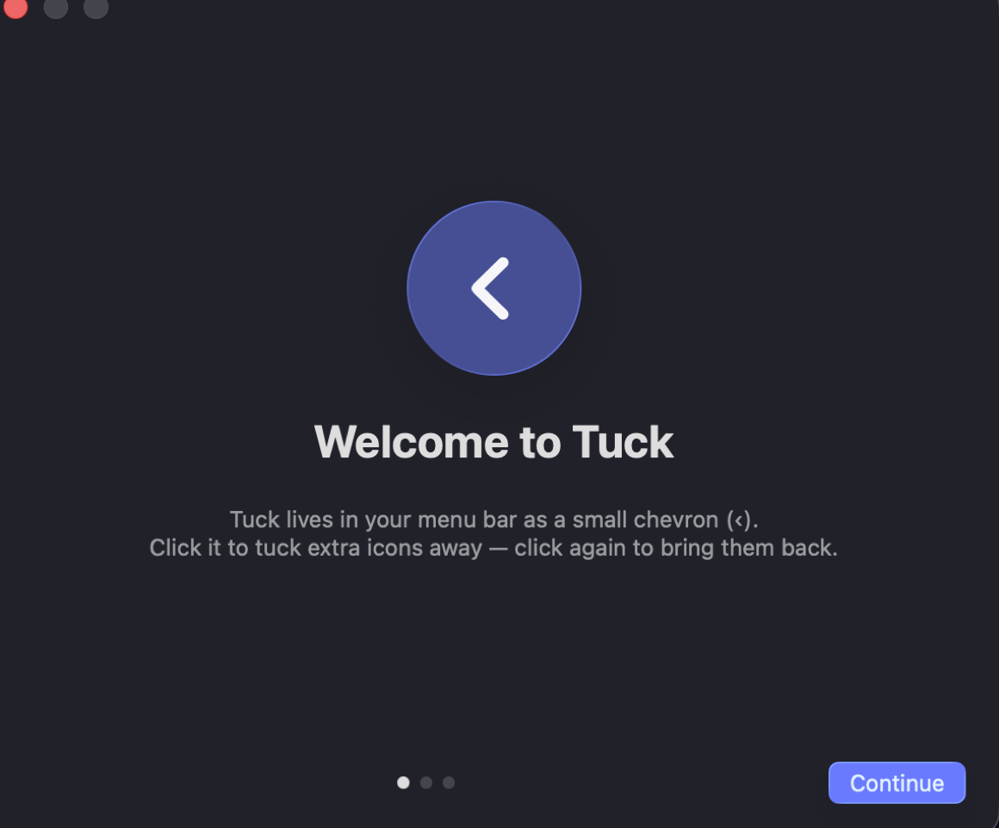

<div align="center">


# Tuck

**A free, open-source menu bar organizer for macOS.**
Tuck your extra menu bar icons away behind a single chevron — like Bartender, but free, GPL-licensed, and permission-free.

[](https://github.com/TonmoyBishwas/Tuck/releases/latest)
[](LICENSE)


</div>

---

## What it does

Your menu bar fills up fast — especially on a MacBook with a notch. Tuck adds a chevron (`‹`) to your menu bar. Click it, and every icon you've marked as "hidden" slides out of sight. Click again to bring them back.

- **One-click hide/show** of any menu bar icons you choose
- **Always-hidden section** for icons you almost never need (option-click the chevron to peek)
- **Auto-rehide** (optional) after a configurable delay, and when you click elsewhere
- **Hover to reveal** (optional) — just move your mouse to the menu bar
- **Global hotkey** (default `⌥⌘\`) — toggle from anywhere, no permissions needed
- **Launch at login**, native Liquid Glass UI, guided first-run tutorial
- **Zero privacy permissions** — no Screen Recording, no Accessibility, no network. Ever.

## Install

1. Download **`Tuck-x.y.z.dmg`** from the [latest release](https://github.com/TonmoyBishwas/Tuck/releases/latest)
2. Open the DMG and drag **Tuck** into **Applications**
3. Launch Tuck. macOS will block it the first time — this is expected (see below), and takes one extra step:

> [!IMPORTANT]
> **Why the warning?** Tuck is a free community project and isn't notarized by Apple (that requires a $99/year developer subscription). The app is open source — you can read every line it runs, or build it yourself.
>
> **To open it (choose either):**
> - Open **System Settings → Privacy & Security**, scroll down, and click **"Open Anyway"** next to the Tuck message, then confirm. *(On macOS Sequoia and later, right-click → Open no longer works.)*
> - Or run this one-liner in Terminal:
>   ```sh
>   xattr -dr com.apple.quarantine /Applications/Tuck.app
>   ```
>   This removes the "downloaded from the internet" flag from Tuck only — it doesn't change any system security settings.

## First-run setup

Tuck's tutorial walks you through this, but it's one gesture:

**Hold ⌘ (Command) and drag** any menu bar icon to the **left** of Tuck's divider (`│`). That's it — those icons now hide when you click the chevron.

```
 (always hidden)  ┆  (hidden when tucked)  │  ‹  (always visible)   🕐
                  └ dashed divider          └ divider   └ the Tuck chevron
```

- Icons left of the **dashed divider** (`┆`) stay hidden even when expanded — **option-click** the chevron (or use the hotkey) to peek at them.
- **Right-click** the chevron for the menu: toggle, settings, quit.

## Screenshots

| Expanded | Tucked |
|---|---|
|  |  |



## Requirements

- macOS 26 (Tahoe) or later
- Apple Silicon (M1 or newer)

## How it works (and why it needs no permissions)

Tuck uses the classic "expanding separator" technique pioneered by Hidden Bar and Dozer: macOS lays out status items right-to-left and clips whatever doesn't fit at the left edge. Tuck places an invisible spacer in your menu bar and inflates its width to push the hidden section off-screen. No private APIs, no screen capture, no synthesized input events — which is why Tuck never asks for Screen Recording or Accessibility access, unlike more feature-heavy alternatives.

The trade-off: features that require reading *other apps'* menu bar items (search, showing hidden icons in a floating bar, auto-reveal of an icon that changes) are out of scope for now — see the roadmap.

## Build from source

```sh
git clone https://github.com/TonmoyBishwas/Tuck.git
cd Tuck
./scripts/build-app.sh          # → dist/Tuck.app
./scripts/build-dmg.sh          # → dist/Tuck-<version>.dmg (optional)
open dist/Tuck.app
```

Requires Xcode 26+. For development, `swift run` works directly, and `open Package.swift` gives you the full Xcode experience.

## FAQ

**Why is it macOS 26+ / Apple Silicon only?**
Tuck is built with the Liquid Glass design language introduced in macOS Tahoe and ships as a lean arm64-only binary. Older systems are well served by [Hidden Bar](https://github.com/dwarvesf/hidden) and [Ice](https://github.com/jordanbaird/Ice).

**An icon got "lost" under the notch!**
macOS silently hides menu bar items that don't fit around the notch — this happens with or without Tuck, and there's no public API to detect it. Tucking icons away actually *frees* space and helps avoid it.

**The chevron and divider got out of order.**
Hold ⌘ and drag them back: the divider (`│`) belongs to the left of the chevron (`‹`). Tuck refuses to hide anything while the order is wrong, so you can't lose icons.

**Launch at login doesn't stick.**
Make sure Tuck is running from `/Applications` (not from the DMG or a build folder), then toggle it again in Settings → General.

## Roadmap

- [ ] Menu bar item search palette
- [ ] Floating "Tuck Bar" showing hidden icons below the menu bar (the real notch fix)
- [ ] Profiles & triggers (show items on battery/Wi-Fi/app conditions)
- [ ] Homebrew cask
- [ ] Localization

Contributions welcome — the codebase is small and documented. Open an issue or PR!

## Acknowledgements

Tuck stands on the shoulders of [Hidden Bar](https://github.com/dwarvesf/hidden), [Dozer](https://github.com/Mortennn/Dozer), and [Ice](https://github.com/jordanbaird/Ice), and uses [KeyboardShortcuts](https://github.com/sindresorhus/KeyboardShortcuts) by Sindre Sorhus.

## License

[GPL-3.0](LICENSE) © 2026 Tonmoy Bishwas
